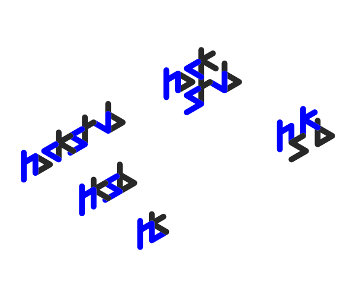
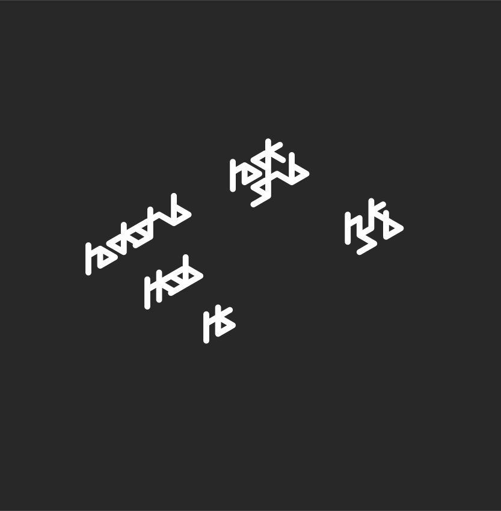

logo hackstub
=============

####logos-hackstub-all-toReworkFile.svg
	//fichier à modifier pour retravailler le logo
	contours : 3,46 mm
	couleurs : bleu = #0000FF ; gris = #282828

####logos-web/
	//logos à destination du web (stroke version)
	
####logos-print/
	//logos à destination de l'impression (fill version)
	
####grille.svg
	module :      1,73 * 2    
	inclinaison : 30°

####hksb-font.svg
	26 lettres + chiffres
	todo : accents, ponctuation classique
	

####plus/
	//titres avec la font hksb
 
 

##versions
logo-hksb-special.svg

logos-hackstub-b.svg

logos-hackstub-w.svg

